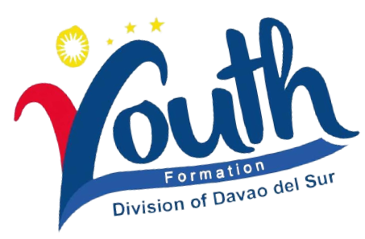
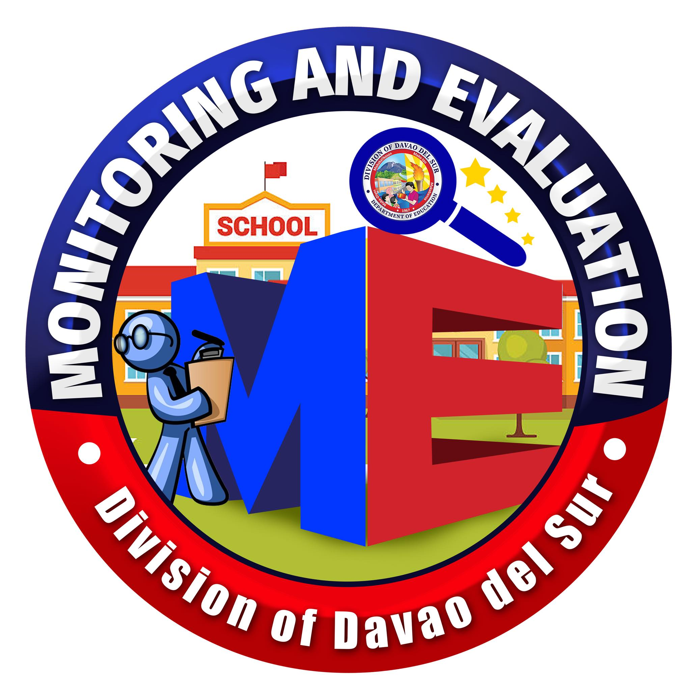
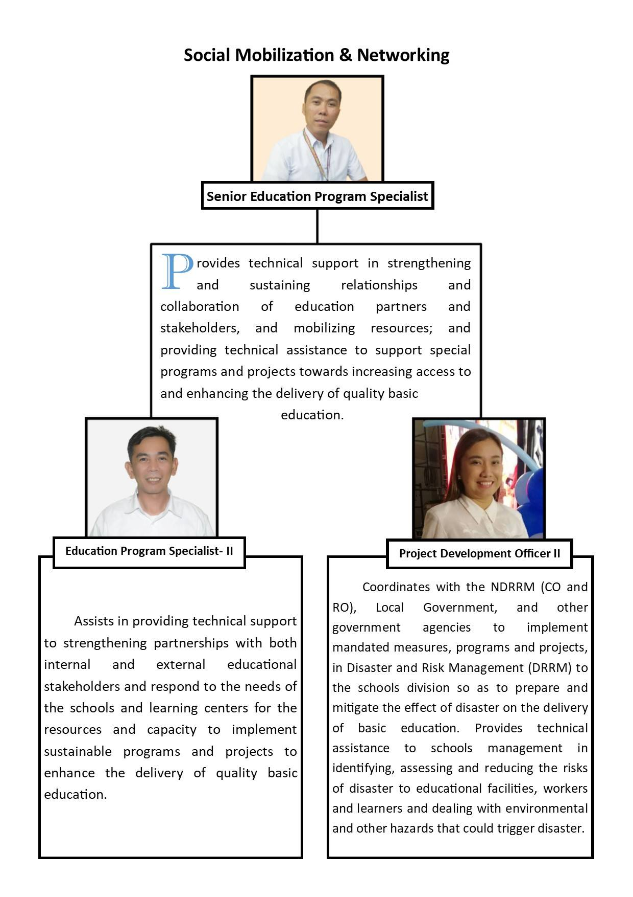

```{r setup, include=FALSE} 
 knitr::opts_chunk$set(echo = FALSE) 
``` 

```{css} 
 d-title { display: none; } 
```
 
<body>

&nbsp;
&nbsp;

<center>
<a href="#youth-formation-division">
{width=30%}
</a>
<a href="#school-management-monitoring-evaluation-smme">
{width=20%}
</a>
<a href="#social-mobilization-and-network">
{width=30%}
</a>
</center>

&nbsp;
&nbsp;


## **YOUTH FORMATION DIVISION**

<center>
`r kableExtra::text_spec("About", color = "red")`
</center>

<center>


The YFD aims to develop the country’s youth for societal growth.

It aspires to mold learners into **pro-active Filipino Youth** who understands that society cannot succeed unless all its parts work together to address the nation’s aspirations.

Further, it is anchored in supporting the implementation of the K to 12 curriculum by honing and complementing the following learning areas and skills: **Societal Engagement, Technical Skills, Social Skills, Creativity** and **Innovation Skills, Affective skills,** and **Self Mastery Skills**.
</center>

<center>

### YFD Purpose

The YFD endeavors to provide youth-serving units and organizations with **responsive, learner-centered, youth-oriented policies, standards, guidelines, programs,** and **projects**  which shall contribute to the holistic development of learners who are **value-driven, career-oriented, culturally-rooted** and **socially responsible.**
</center>

<center>

### YFD Goal

The YFD strives to empower Filipino children and youth imbued with the values,  **maka-Diyos, maka-Tao, maka-Kalikasan,** and  **maka-Bansa,** enabling them to become highly-skilled individuals who are responsible, hardworking, enterprising, persevering, value-driven, and culturally-rooted.

</center>

&nbsp;
&nbsp;

<center>
`r kableExtra::text_spec("What we do", color = "red")`

### ENRICHED STUDENT PARTICIPATION

Amid the global pandemic, everything seemed to have halted. While the rest of the world is still trying to solve a seemingly endless puzzle to unlock the mysteries of a novel virus, the Youth Formation Division (YFD) has taken this unprecedented time as an opportunity to virtually maximize and unlock the full potential of a proactive Filipino youth. With “puso, galling at talion” thousands of student leaders across the country initiated programs, projects, and activities that benefit their fellow youth and the community in general.

</center>

<p align="right">
<a href="#top">Back to top</a>
</p>

&nbsp;
&nbsp;


## **SCHOOL MANAGEMENT MONITORING & EVALUATION (SMM&E)**

<center>
Supports schools with the implementation of quality management systems. Assist districts and schools/learning centers in implementing an M&E system to track progress and ensure compliance with standards and policies related to the effective and efficient delivery of quality basic education.

</center>

<style>
table, th, td {
  border:1px solid black;
}
</style>

<table style="width:100%", style="border: 5px solid #990000; border-collapse: collapse">
  <tr>
    <th style="text-align:center"> Key Result Area 
    </th>
    <th style="text-align:center"> Duties 
    </th>
  </tr>
  <tr>
    <td style="text-align:center"> **Quality Management System**
    </td>
    <td> 
      <ul>
        <li> Implement quality assurance processes on: </li>
          <ul>
           <li> School Planning </li>
           <li> School Based Management </li>
           <li> Implementation of Programs & Projects as basis for continuous improvement        
           </li>
          </ul>
        <li> Validate report on Schools Achievements and Learning Outcomes </li>
        <li> Monitor performance of SDO along: </li>
          <ul> 
            <li> TA to schools and LCs </li>
            <li> Equitable Distribution of educational resources to schools and LCs               </li>
          </ul>
          <li> Report/document best practices in school management and governance for the purpose of sharing and benchmarking; provide inputs to the school's accreditation process.  
          </li>
        </ul>
    </td>
    </tr> 
    <tr>
      <td style="text-align:center"> **Assessment** 
      </td>
      <td> 
        <ul>
          <li> Implement Division assessment program aligned to national assessment framework   
          </li>
          <li> Validate/ authenticate assessment strategies and tools for utilization by schools, in classrooms and learning centers
          </li>
          <li> Prepare and submit a report on assessment results for the purpose of monitoring student progress and grading in order to establish the method's validity and reliability.
          </li>
        </ul>
      </td>
      <tr>
      <td style="text-align:center"> **School Compliance to Quality Standards (Public And Private)**
      </td>
      <td>
        <ul> 
          <li> Provide accreditation-related information, education, and advocacy programs and materials
          </li>
          <li> Validated documents of schools requesting permit to operate.
          </li>
          <li> Endorse complete portfolio of documents of schools requesting to operate.
          </li>
        </ul>
      </td>
      </tr>
      <tr>
      <td style="text-align:center"> **Research and Development**
      </td>
      <td> 
        <ul>
          <li> Conduct action research on the factors that contribute to the success of programs and projects in schools.
          </li>
        </ul>
      </td>
      </tr>
      <tr>
      <td style="text-align:center"> **Technical Assistance to Schools and Learning Center**
      </td>
      <td> 
        <ul> 
          <li> Provide Technical Assistance to schools and learning centers by responding to the identified needs
          </li>
        </ul>
      </td>
      </tr>
</table>

<p align="right">
<a href="#top">Back to top</a>
</p>


## **SOCIAL MOBILIZATION AND NETWORK**

<table style="width:100%">
  <tr>
  <th colspan="2", style="text-align:center"> Senior Education Program Specialist </th>
  </tr>
  <tr>
  <td colspan="2">
  Provides technical support in strengthening and sustaining relationships and collaboration of education partners and stakeholders, and mobilizing resources; and providing tehnical assistance to support special programs and projects towards increasing access to and enhancing delivery of quality basic education.
  </td>
  </tr>
  <tr> 
    <td style="text-align:center"> **Education Program Specialist II** </td>
    <td style="text-align:center"> **Project Development Officer II** </td>
  </tr>
  <tr>
    <td> Assists in providing technical support to strengthening partnerships with both internal and external educational stakeholders and respond to the needs of the schools and learning centers for the resources and capacity to implement sustainable programs and projects to enhance the delivery of quality basic education.
    </td>
    <td> Coordinates with the NDRRM (CO and RO), Local  Government, and other government agencies to implement mandated measures, programs and projects, in Disaster and Risk Management (DRRM) to the schools division so as to prepare and mitigate the effect of disaster on the delivery of basic education. Provides technical assistance to schools management in identifying, assessing and reducing the risks of disaster to educational facilities, workers and learners and dealing with environmental and other hazards that could trigger disaster.
    </td>
  </tr>
</table>

</center>

<p align="right">
<a href="#top">Back to top</a>
</p>


## **HUMAN RESOURCE DEVELOPMENT**
<center>
text
</center>

<p align="right">
<a href="#top">Back to top</a>
</p>


## **PLANNING AND RESEARCH**
<center>
text
</center>

<p align="right">
<a href="#top">Back to top</a>
</p>

</body>


