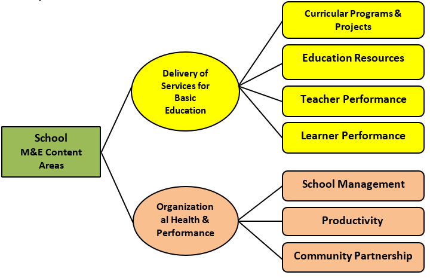

```{r setup, include=FALSE} 
 knitr::opts_chunk$set(echo = FALSE) 
``` 

```{css} 
 d-title { display: none; } 
```
 
<center>
[{width=405}](https://www.facebook.com/padadanhs)
</center>

&nbsp;
&nbsp;

<center>
`r kableExtra::text_spec("About", color = "red")`

## YOUTH FORMATION DIVISION
</center>


<center>


The YFD aims to develop the country’s youth for societal growth.

It aspires to mold learners into **pro-active Filipino Youth** who understands that society cannot succeed unless all its parts work together to address the nation’s aspirations.

Further, it is anchored in supporting the implementation of the K to 12 curriculum by honing and complementing the following learning areas and skills: **Societal Engagement, Technical Skills, Social Skills, Creativity** and **Innovation Skills, Affective skills,** and **Self Mastery Skills**.
</center>

<center>

### YFD Purpose

The YFD endeavors to provide youth-serving units and organizations with **responsive, learner-centered, youth-oriented policies, standards, guidelines, programs,** and **projects* ** which shall contribute to the holistic development of learners who are **value-driven, career-oriented, culturally-rooted** and **socially responsible.**
</center>

<center>

### YFD Goal

The YFD strives to empower Filipino children and youth imbued with the values,  **maka-Diyos, maka-Tao, maka-Kalikasan,** and  **maka-Bansa,** enabling them to become highly-skilled individuals who are responsible, hardworking, enterprising, persevering, value-driven, and culturally-rooted.

</center>

&nbsp;
&nbsp;

<center>
`r kableExtra::text_spec("What we do", color = "red")`

## ENRICHED STUDENT PARTICIPATION

Amid the global pandemic, everything seemed to have halted. While the rest of the world is still trying to solve a seemingly endless puzzle to unlock the mysteries of a novel virus, the Youth Formation Division (YFD) has taken this unprecedented time as an opportunity to virtually maximize and unlock the full potential of a proactive Filipino youth. With “puso, galling at talion” thousands of student leaders across the country initiated programs, projects, and activities that benefit their fellow youth and the community in general.

</center>

&nbsp;
&nbsp;

<center>

## School Management Monitoring & Evaluation (SMM&E)

Provides technical support in implementing quality management systems in schools. Lead districts and schools/learning centers in the implementation of an M&E system to monitor their progress and adhere to standards and policies towards effective and efficient delivery of quality basic education.

</center>


<center>

### Purpose and Objectives of M & E


M&E in schools aims to **provide objective information** that can **inform decision-making** in order to continuously improve the delivery of school services for basic education and the school’s performance or health to achieve the desired education outcomes. M&E in schools aims to provide valid, reliable and accurate data in decision-making to come up with possible actions and interventions to achieve the desired education outcomes.

</center>

Five specific operational objectives are identified in support of the overall purpose of M&E in the school:

**OBJECTIVES**

  1. Provide the school management and stakeholders information on the implementation of the **curricular programs and projects as** basis for continuously improving their relevance, efficiency and effectiveness  
  2. Provide information for school management to determine and adjust approaches and strategies that will ensure adequacy, equitable distribution, accessibility, and effective and optimal use of the **resources** of the school
  3. Establish information as basis for determining appropriate approach / strategy to improve **teaching-learning competencies of teachers** to ensure efficient and effective delivery of instruction, classroom management, and their personal growth and professional development  
  4. Present information regarding **learner performance** to the school management that will support decisions and adjustments to plans and strategies to improve the learners’ academic achievement, school attendance, and participation in co-curricular activities.
  5. Provide information for school management to review and sustain the strategies that can improve the **school’s health or performance** through:
  
      * Efficient school-based management
      * Productivity of the teaching and non-teaching staff
      * Strengthening partnership with the community
      
**Underlying Principles**

The development of the Monitoring and Evaluation Framework for the school is to be guided by the following principles:

  a. **Quality Information**

It is important that M&E information to be collected is appropriate, sufficient and accurate to ensure reliable and objective reports that can be used as bases for planning and decision-making at all levels. 
  
  b. **Systems Strengthening**

Strategies, processes, and tools to be used for M&E can make use of available systems that have been tried and effectively used in the department.  .  (available and established mechanism)

  c. **Efficiency**
  
Results are achieved with minimum input resources but not compromising quality in all levels and stages of M&E. This includes the ability to report on target sub-groups in a timely manner. (Efficiency in general describes the extent to which time or effort is well used for the intended task or purpose in the production of desired goals and outputs.)

  d. **Transparency of Information to Key Stakeholders**
  
M&E subscribes to open, full and credible information. It encourages timely disclosure of information and methodology to stakeholders which are aligned to M&E objectives and processes.

  e. **Synergy**
  
M&E encourages participative and collaborative decision-making processes among the different entities for an integrated approach to the attainment of its objectives.

  f. **M&E for Learning and Accountability**
  
M&E provides opportunities for continuous improvement of practices/performance through identification of issues and lessons learned.  It requires trustworthy, competent and impartial M&E staff.

  g. **Focus**

M&E calls for careful planning and purposive prioritization of activities guided by the school goals and objectives.  “Change does not happen by accident.” The school is a key instrument to implement that change.


### SCOPE OF M&E

**M&E Content Areas**

M&E of the school is designed to obtain and provide information on content areas that have been derived from the stakeholders’ major areas of interests.  There are two major focal areas where decisions need to be made:  *Delivery of Services for Basic Education and Organizational Health/Performance.*

```{r, echo=FALSE,out.width="40%", fig.align='center', fig.cap="M & E Content Areas of Schools"}

```

<a href="#top">Back to top</a>

