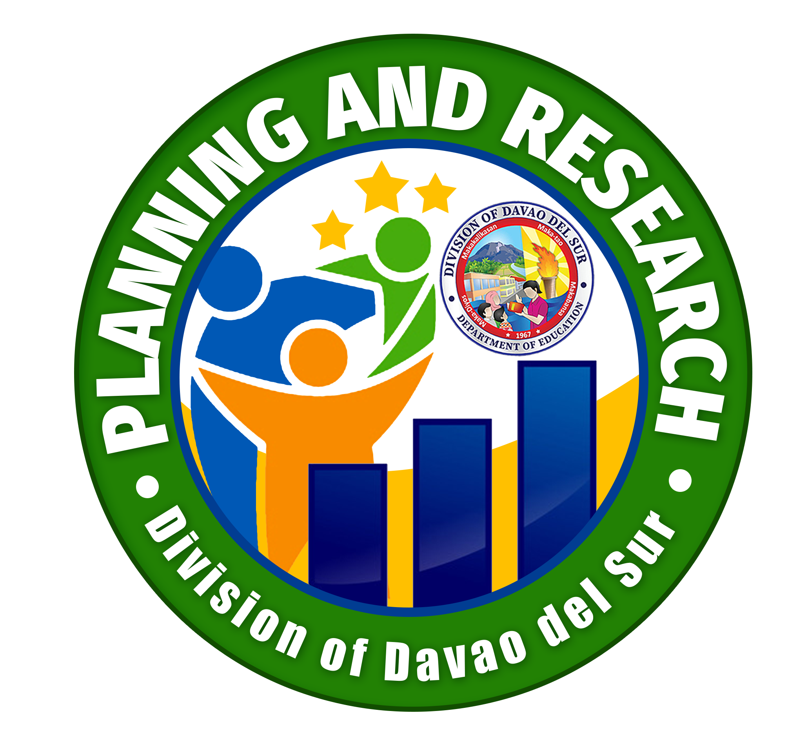

```{r setup, include=FALSE}
knitr::opts_chunk$set(echo = TRUE)
```

<center>
## **YOUTH FORMATION DIVISION**
</center>

<center>
[{width=50%}](https://www.facebook.com/youthformationdavaodelsur/)
</center>
&nbsp;
&nbsp;

```{r, echo=FALSE,out.width="40%", fig.align='center'}
knitr::include_graphics("D:/Website/YFD/Del_Sur_YFD/staff/joveth.jpg")
```

<center>

**JOVETH G. TUBIANO**

Project Development Officer I

09054424100

joveth.tubiano@deped.gov.ph

*Barkada Kontra Droga (BKD)*

*Gulayan sa Paaralan Program (GPP)*

*National Greening Program (NGP)*

*Youth for Environment in School's Organization (YES-O)*

*School Inside a Garden (SIGA)*

</center>

&nbsp;
&nbsp;

```{r, echo=FALSE,out.width="40%", fig.align='center'}
knitr::include_graphics("D:/Website/YFD/Del_Sur_YFD/staff/niel.jpg")
```

<center>

**NEIL JOHN T. AUDAN**

Project Development Officer I

09555143994

neiljohn.audan@deped.gov.ph

*Student Government (SSG/SPG)*

*We Advocate Time Consciousness and Honesty (WATCH)*

*Child Protection Policy*

</center>


<center>
## **SCHOOL MANAGEMENT MONITORING & EVALUATION (SMM&E)**
</center>

<center>
{width=40%}
</center>
&nbsp;
&nbsp;

```{r, echo=FALSE,out.width="40%", fig.align='center'}
knitr::include_graphics("D:/Website/YFD/Del_Sur_YFD/staff/boubert.jpg")
```
<center>

**BOUBERT G. DUMAGAN**

Senior Education Program Specialist

09176854498

boubert.dumagan@deped.gov.ph

</center>

&nbsp;
&nbsp;


```{r, echo=FALSE,out.width="40%", fig.align='center'}
knitr::include_graphics("D:/Website/YFD/Del_Sur_YFD/staff/kirk.jpg")
```

<center>

**KIRK SONNY GIL P. HERUELA, PhD**

Education Program Specialist II

09163981596

kirksonnygil.heruela@deped.gov.ph

</center>

<center>
## **SOCIAL MOBILIZATION AND NETWORKING**
</center>

<center>
{width=50%}
</center>
&nbsp;
&nbsp;

```{r, echo=FALSE,out.width="40%", fig.align='center'}
knitr::include_graphics("D:/Website/YFD/Del_Sur_YFD/staff/quilaton.jpg")
```
<center>

**BERNIE QUILATON**

Senior Education Program Specialist

+639123456789

@email.com

</center>

&nbsp;
&nbsp;

```{r, echo=FALSE,out.width="40%", fig.align='center'}
knitr::include_graphics("D:/Website/YFD/Del_Sur_YFD/staff/whodis.jpg")
```
<center>

**ANTONIO IV C. PACE**

Senior Education Program Specialist

+639123456789

@email.com

</center>

&nbsp;
&nbsp;

```{r, echo=FALSE,out.width="40%", fig.align='center'}
knitr::include_graphics("D:/Website/YFD/Del_Sur_YFD/staff/chicote.jpg")
```
<center>

**CHERRY JOY CHICOTE**

Project Development Officer II

+639123456789

@email.com

</center>

<center>
## **HUMAN RESOURCE DEVELOPMENT**
</center>

<center>
{width=40%}
</center>
&nbsp;
&nbsp;

```{r, echo=FALSE,out.width="40%", fig.align='center'}
knitr::include_graphics("D:/Website/YFD/Del_Sur_YFD/staff/elyn.jpg")
```
<center>

**ELYN SUPRENTE**

Senior Education Program Specialist

+639123456789

@email.com

</center>

&nbsp;
&nbsp;

```{r, echo=FALSE,out.width="40%", fig.align='center'}
knitr::include_graphics("D:/Website/YFD/Del_Sur_YFD/staff/lemuel.jpg")
```

<center>

**LEMUEL C. MADULIN**

Education Program Specialist II

+639123456789

@email.com

</center>

<center>
## **PLANNING AND RESEARCH**
</center>

<center>
{width=45%}
</center>
&nbsp;
&nbsp;

```{r, echo=FALSE,out.width="40%", fig.align='center'}
knitr::include_graphics("D:/Website/YFD/Del_Sur_YFD/staff/amy.jpg")
```
<center>

**AMY CORRAL**

Planning Officer

+639123456789

@email.com

</center>

&nbsp;
&nbsp;

```{r, echo=FALSE,out.width="40%", fig.align='center'}
knitr::include_graphics("D:/Website/YFD/Del_Sur_YFD/staff/kirk.jpg")
```

<center>

**KIRK SONNY GIL P. HERUELA, PhD**

Education Program Specialist II

09163981596

kirksonnygil.heruela@deped.gov.ph

</center>

<center>
## **TOP MANAGEMENT**
</center>

<center>
{width=40%}
</center>
&nbsp;
&nbsp;

```{r, echo=FALSE,out.width="40%", fig.align='center'}
knitr::include_graphics("D:/Website/YFD/Del_Sur_YFD/staff/nelson.jpg")
```
<center>

**NELSON C. LOPEZ, CESO V**

Schools Division Superintendent 


</center>

&nbsp;
&nbsp;

```{r, echo=FALSE,out.width="40%", fig.align='center'}
knitr::include_graphics("D:/Website/YFD/Del_Sur_YFD/staff/janette.jpg")
```
<center>

**JANETTE G. VELOSO, EdD**

Assistant Schools Division Superintendent

</center>

&nbsp;
&nbsp;

<center>
## **SCHOOL GOVERNANCE AND OPERATIONS DIVISION**
</center>

<center>
{width=45%}
</center>
&nbsp;
&nbsp;

```{r, echo=FALSE,out.width="40%", fig.align='center'}
knitr::include_graphics("D:/Website/YFD/Del_Sur_YFD/staff/mario.jpg")
```


<center>


**MARIO C. MONDEJAR, EdD**

Chief Education Program Supervisor - SGOD

</center>

<p align="right">
<a href="#top">Back to top</a>
</p>


